# Advanced Kustomize Features
## Learning Objectives
- Master the use of Overlays for environment-specific configuration management.
- Use Transformers and Generators to customize Kubernetes resources.
- Manage Secrets and ConfigMaps effectively and securely.
- Apply configurations to an Amazon EKS cluster using kubectl and kustomize.

## Prerequisites
1.	Basic Understanding of Kubernetes	Familiarity with Kubernetes concepts and resources.	Kubernetes Basics
2.	Kustomize	Essential for customizing Kubernetes configurations.	Install Kustomize
3.	Docker	Required for running containerized applications.	
4.	kubectl	CLI tool to interact with the Kubernetes cluster.	
5.	AWS CLI	Used to manage AWS services.
6.	eksctl	CLI tool for creating and managing EKS clusters.
7.	AWS Account	Required with IAM permissions to create/manage EKS resources.	
8.	Code Editor	Recommended for editing YAML files.
9.	Internet Connection	Required for downloading tools and interacting with AWS.	—
10.	Computer with Adequate Resources	Ensure your system can run EKS, Docker, and CLI tools smoothly.	—

## Project Structure
A typical directory structure for this project will look like this:

```
advanced-kustomize-features
│
├── base/
│   ├── deployment.yaml
│   ├── service.yaml
│   └── kustomization.yaml
│
└── overlays/
    ├── dev/
    │   ├── replica_count_dev.yaml
    │   └── kustomization.yaml

    │
    ├── staging/
    │   ├── replica_count_staging.yaml
    │   └── kustomization.yaml
    │
    └── prod/
        ├── labels.yaml
        └── kustomization.yaml
```

## Lesson 3.1 — Working with Overlays
Objective:
Master the use of Overlays in Kustomize for managing different environment configurations.

Key Concept:
Each environment (Dev, Staging, Prod) will have a separate overlay directory that customizes a shared base configuration.

Example:

```mkdir -p overlays/{dev,staging,prod}```

Sample Overlay (dev):

```
# overlays/dev/kustomization.yaml
bases:
  - ../../base
patchesStrategicMerge:
  - replica_count_dev.yaml
```

Apply it to your EKS cluster:

```kubectl apply -k overlays/dev/```

## Lesson 3.2 — Transformers and Generators
Objective:
Use Transformers and Generators to customize resource attributes dynamically.

Example 1 — Add Common Labels:

```
# overlays/prod/kustomization.yaml
commonLabels:
  env: production
```
Example 2 — Add Name Prefix:
```
# overlays/staging/kustomization.yaml
namePrefix: staging-
```
These help differentiate resources across environments.

## Lesson 3.3 — Secrets and ConfigMaps Management
Objective:
Learn to create and manage ConfigMaps and Secrets securely using Kustomize.

Example ConfigMap Generator:

```
# base/kustomization.yaml
configMapGenerator:
  - name: my-configmap
    literals:
      - key1=value1
      - key2=value2
```
Example Secret Generator:
```
# base/kustomization.yaml
secretGenerator:
  - name: my-secret
    literals:
      - username=admin
      - password=s3cr3t
```
⚠️ Note: For production, use external secret management tools or environment variables to handle sensitive data safely.

## Deployment
After defining your overlays and customizations, deploy your resources using:

``` 
kubectl apply -k overlays/dev/
kubectl apply -k overlays/staging/
kubectl apply -k overlays/prod/
```
## Expected Outcomes
By the end of this project, you’ll be able to:

- Configure multiple environments using Overlays
- Apply Transformers and Generators for scalable customization
- Manage Secrets and ConfigMaps efficiently
- Deploy configurations seamlessly to an EKS cluster


## Step Screen Shoots
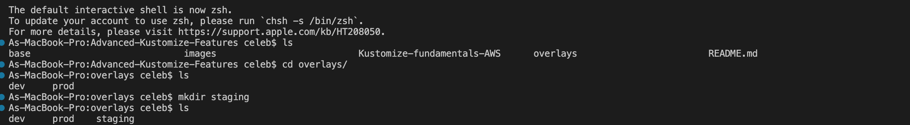
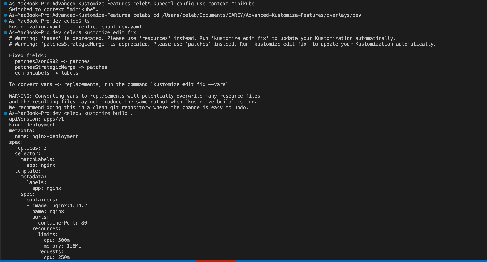
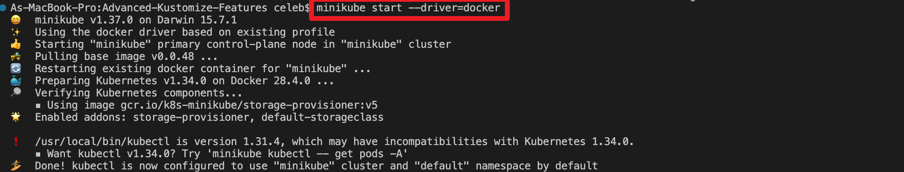
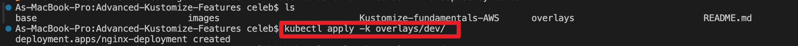
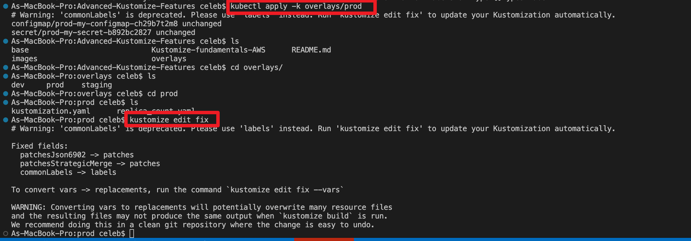
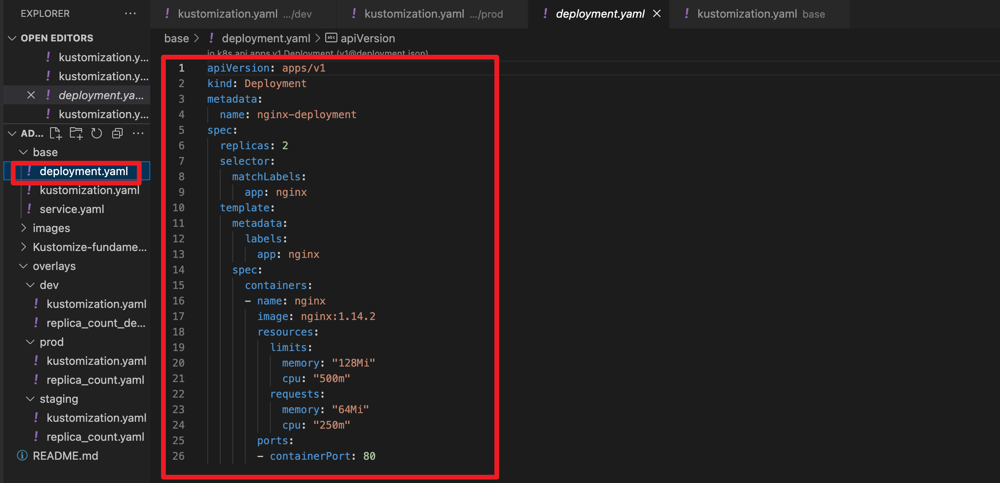
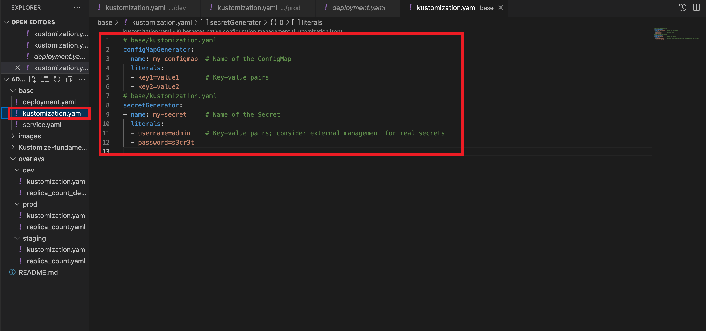
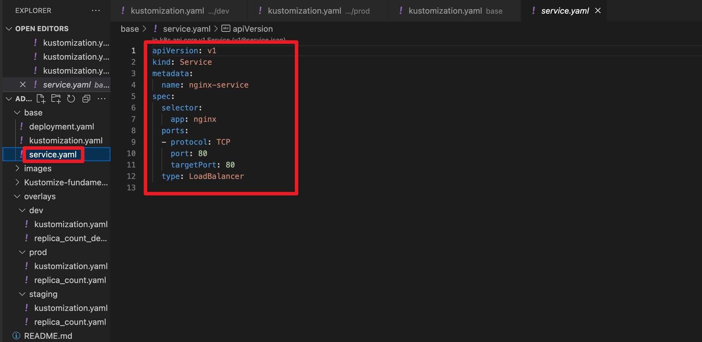
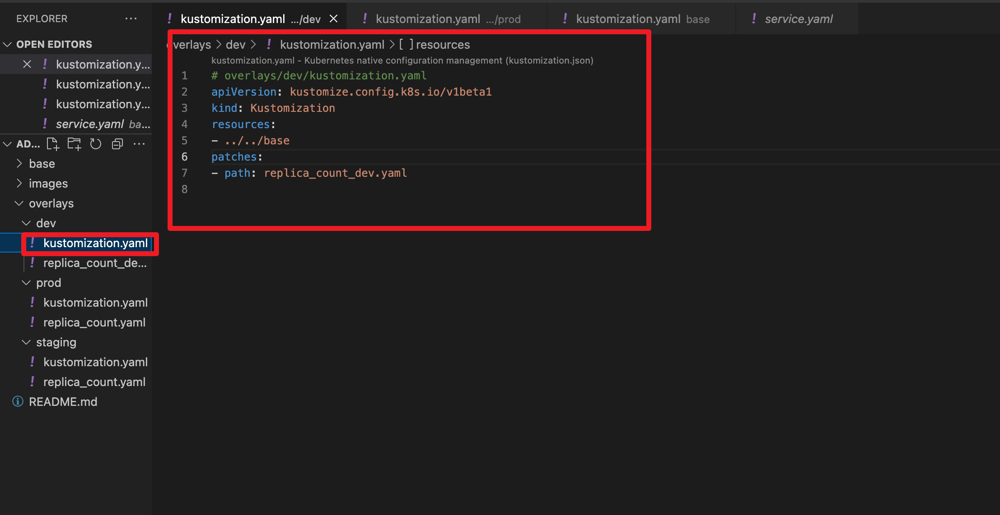
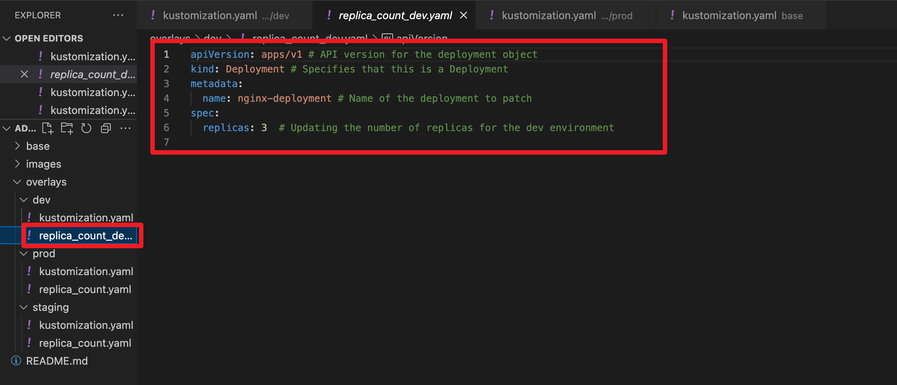
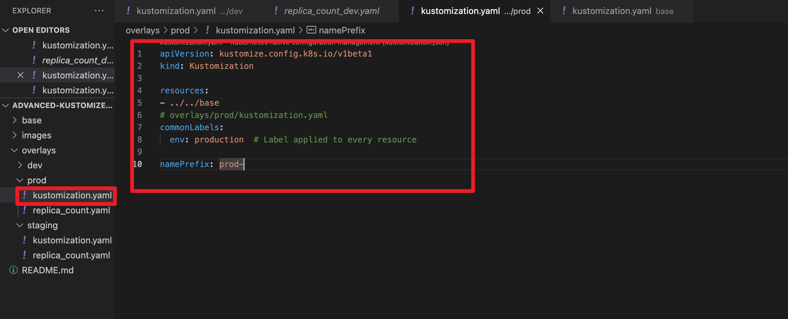
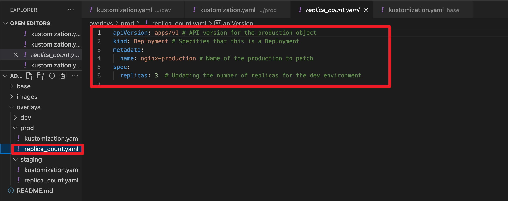